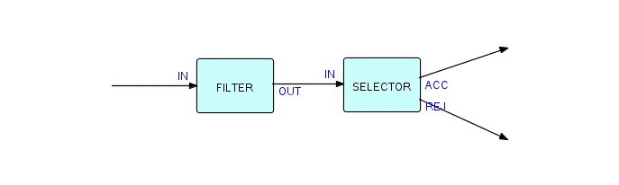
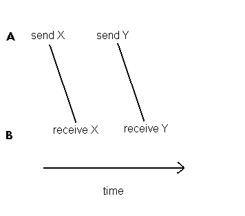
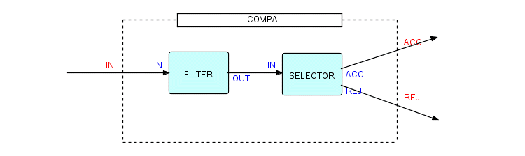
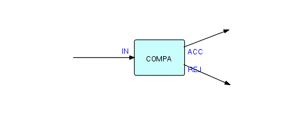
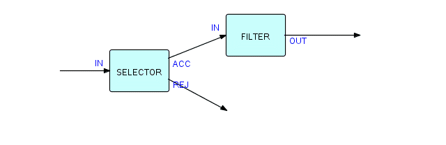

# Основные понятия

В середине этого столетия ожидалось, что компьютеры смогут делать все, что люди могут им объяснить. Но даже тогда некоторые люди задавались вопросом, насколько легко это удасться. Книга «Быстрее мысли» (Bowden 1963), впервые опубликованная в 1950-х годах, содержит следующее замечание:

> Математики всегда возмущаются, когда впервые сталкиваются с коммерческой работой, тому, насколько она сложна» (стр. 258)

И далее:

> ... на практике любую программу так сложно сделать правильно, что может потребоваться несколько математиков, чтобы ухаживать за большой машиной в офисе ... Похоже, опытные программисты всегда будут в цене ( стр.259)

В те дни основным препятствием считалась сложность описания точных правил бизнес-логики. Это оказалось также сложно, как мы и думали, но по совершенно другим причинам. Сегодня же мы видим - проблема фактически встроена в фундаментальные принципы проектирования нашего базового вычислительного механизма - машины фон Неймана, о которой упоминалось в главе 1.

Машина фон Неймана идеально адаптирована к математическим алгоритмическим задачам, для которых была создана: таблицы приливов, баллистические расчеты и т.д., Но бизнес-приложения по своей другие по своей природе. В качестве примера этих различий основным строительным блоком программирования является подпрограмма, с тех пор как была впервые описана [Адой, графиней Лавлейс](https://en.wikipedia.org/wiki/Ada_Lovelace), дочерью [лорда Байрона](https://en.wikipedia.org/wiki/Lord_Byron), в прошлом веке (прим.пер. - уже позапрошлом). Неплохое достижение, особенно, если учесть, что компьютеров еще не было! Эта концепция была прочно основана на математической идее функции, и любой программист сегодня знает о ряде стандартных подпрограмм и может при необходимости придумать новые. Это может быть «квадратный корень», «двоичный поиск», «синус», «отображение денежной суммы в удобочитаемом формате» и проч.Каковы основные строительные блоки бизнес-приложений? Легко перечислить такие функции, как «слияние», «сортировка», «разбиение отчета на страницы» и т.д, Но ни одна из них, похоже, не поддается инкапсулированию в качестве подпрограмм. Они другой природы - вместо того, чтобы быть функциями, которые работают в один момент времени, все они имеют работают в течение определенного периода времени с несколькими (иногда большим множеством) элементов ввода и вывода.

Где-то в этой точке мы начинаем подозревать, в чем может состоять эта разница. Бизнес-программирование работает с данными и концентрируется на том, как эти данные преобразуются, объединяются и разделяются для получения желаемых результатов и изменения хранимых данных в соответствии с бизнес-требованиями. Вообще говоря, в то время как традиционные подходы к программированию (называемые «[потоком управления](https://en.wikipedia.org/wiki/Control_flow)» начинаются с процесса и рассматривают данные как второстепенные, бизнес-приложения обычно разрабатываются, начиная с данных и рассматривая процесс как второстепенный, как просто способ создания данных, манипуляции и уничтожения. Мы часто называем этот подход «[потоком данных](https://en.wikipedia.org/wiki/Dataflow_programming)», и это ключевая концепция многих наших методологий проектирования. Когда мы пытаемся преобразовать это представление в процедурный код, мы начинаем сталкиваться с проблемами.

Теперь взглянем под другим углом. Сравним чисто алгоритмическую задачу с похожей на вид бизнес-задачей. Мы начнем с простого числового алгоритма: вычисления числа в n-й степени, где `n` - положительный целочисленный показатель степени. Это должно быть знакомо читателям, и на самом деле это не лучший способ сделать этот расчет, но его будет достаточно, чтобы изложить мою мысль. В псевдокоде это можно выразить следующим образом:

```
/_ Calculate a to the power b _/
x = b
y = 1

do while x > 0
    y = y \* a
    x = x - 1
enddo

return y
```

Фрагмент 3.1

Это очень простой алгоритм - его легко понять, легко проверить, легко изменить, он основан на хорошо понятных математических концепциях. Давайте теперь повторим с, на первый взгляд похожей логикой, с файлами и записями, а не числами. Новый алгоритм имеет ту же структуру, что и предыдущий, но работает с потоками записей. Проблема в том, чтобы создать файл `OUT`, который является подмножеством другого, `IN`, где должны быть выведены записи, которые удовлетворяют заданному критерию `c`. Записи, которые не удовлетворяют `c`, должны быть исключены. Это довольно распространенное требование, которое обычно кодируется с использованием некоторой формы следующей логики:

```
read into a from IN
do while read has not reached end of file
    if c is true
        write from a to OUT
    endif
    read into a from IN
enddo
```

Фрагмент 3.2

Какое действие применяется к тем записям, которые не удовлетворяют нашему критерию? Что ж, они загадочно исчезают из-за того, что не записываются в `OUT` до того, как будут уничтожены при следующем "чтении". Большинство программистов, читающих это, вероятно, не увидят в этом ничего странного, но, если подумать, не кажется ли это странным, что есть возможность отбрасывать важные вещи, такие как записи, с помощью того, что в действительности есть причуда времени?

Частично это связано с тем, что большинство современных компьютеров имеют единый набор ячеек для хранения, и это хранилище ведет себя совсем не так, как системы хранения в реальной жизни. В реальной жизни бумага, помещенная в ящик, остается там, пока ее намеренно не уберут. Со временем заполняется, предотвращая добавление бумаги. Сравните с хранилищем в компьютере - можно считывать ячейку любое количество раз и постоянно получать одни и те же данные (не зная, делается ли это впервые), или можно данные поверх предыдущих, и более ранние просто исчезнут... Хотя деструктивное хранилище не является неотъемлемой частью машины фон Неймана, оно предполагается во многих функциях машины, и это тот вид хранилища, который реализован в большинстве современные компьютеров. Поскольку память этих машин очень чувствительна к таймингу и поскольку последовательность каждой инструкции должна быть предопределена (а люди допускают ошибки!), невероятно сложно заставить программу выше определенной сложности работать должным образом. И, конечно же, эта парадигма хранения закреплена в большинстве наших языков более высокого уровня в концепции «переменной». В знаменитой статье [Джон Бэкус](https://en.wikipedia.org/wiki/John_Backus) (1978) фактически извинился за изобретение [Фортрана](https://en.wikipedia.org/wiki/Fortran)! Это я и имел в виду, говоря о "странном использовании знака равенства" в языках высокого уровня. Для логика утверждение `J = J + 1` является противоречием (если `J` не является бесконечностью?) - но программисты больше не видят в этом что-то странное!

Предположим, вместо этого мы решили, что запись должна рассматриваться как реальная вещь, например, записка или письмо, которые после создания существуют в течение определенного периода времени и должны быть явно уничтожены, прежде чем покинуть систему. Давайте расширим наш псевдоязык, включив в него эту концепцию, добавив оператор `discard` (на записи надо как-то уметь ссылаться). Наша программа теперь может выглядеть следующим образом:

```
read record a from IN
do while read has not reached end of file
    if c is true
        write a to OUT
    else
        discard a
    endif
    read record a from IN
enddo
```

Фрагмент 3.3

Теперь мы можем переосмыслить `a`: вместо того, чтобы думать о нем как о области хранения, давайте подумаем о `a` как о «дескрипторе», который обозначает конкретную «вещь» - это способ найти вещь, а область в хранилище, в котором вещь хранится. Эти данные вообще не следует рассматривать, как находящиеся в хранилище: они находятся «где-то еще» (в конце концов, не имеет значения, куда их помещает `read`, если информация, которую они содержат, становится доступной для программы). У самих вещей больше атрибутов, чем у их моделей в хранилище. Хранимый образ можно рассматривать как [проекцию объемного объекта на плоскость](https://en.wikipedia.org/wiki/3D_projection). Если мы повторно используем дескриптор, то потеряем доступ к тому, что он описывает. Мы обязаны правильно утилизировать вещи, прежде чем мы сможем повторно использовать их.

Обратите внимание, с каким трудом находится подходящий термин для «вещи»: проблема в том, что это понятие «атомарное» в том смысле, оно не может быть разложено на еще более фундаментальные объекты. У него было несколько названий на различных диалектах FBP, и он имеет некоторое сходство с понятием «объект» в ООП, но я считаю, что лучше дать ему собственное уникальное имя. В дальнейшем мы будем использовать термин «информационный пакет» (или «IP»). IPа могут иметь разную длину от 0 байт до 2 миллиардов - преимущество работы с «дескрипторами» в том, что IPа управляются одинаково, и их отправка и получение стоят одинаково, независимо от их размера.

Пока мы добавили только одну концепцию - IP - к концептуальной модели, которую строим. Псевдокод на рис. 3.3 был программой, работающей в одиночку. Поскольку основная программа может вызывать подпрограммы, которые, в свою очередь, могут вызывать другие подпрограммы, мы имеем по существу ту же структуру, что и в привычных программах, с одной основной рутиной и сабрутинами. Теперь, вместо того, чтобы просто усложнять отдельную программу, как это делается в обычном программировании, отправимся в совершенно другом направлении: визуализируем приложение, построенное из множества таких основных программ, работающих одновременно, с передачей IP между ними. Это очень похоже на фабрику, на которой одновременно работает множество машин, соединенных ленточными конвейерами. Вещи, над которыми идёт работа (автомобили, слитки, радиоприемники, бутылки), перемещаются по конвеерам от одной машины к другой. На самом деле, есть много аналогий, которые мы могли бы использовать: кафетерии, офисы, между которыми проходят служебные записки, люди на коктейльной вечеринке и т.д. После того, как я проработал эти концепции в течение нескольких лет, я повел своих детей посмотреть завод по розливу газировки. Мы видели машины для наполнения бутылок, машины для наклеивания крышек и машины для наклеивания этикеток, но именно связь и поток между этими различными машинами гарантируют, что то, что вы покупаете в магазине, наполнено правильным веществом и не потечёт, пока вы стоите на кассе!

Приложение FBP можно рассматривать как «фабрику данных». Цель любого приложения - принимать данные и обрабатывать их, как слиток превращается в готовую металлическую деталь. Раньше мы думали, что можно будет разрабатывать фабрики программного обеспечения, но теперь мы видим, что это был неправильный образ: мы не хотим производить код массово - нам нужно меньше кода, а не больше. Оглядываясь назад, очевидно, что на фабрике в полезную информацию должны быть преобразованы данные, а не программы.

А теперь подумайте о различиях между характеристиками такой фабрики и обычной единой основной программы. На любом предприятии одновременно выполняется множество процессов, и синхронизация необходима только на уровне отдельного рабочего элемента. В обычном программировании мы должны точно знать, когда происходят события, иначе все пойдет не так. Во многом это связано с тем, как работает хранилище сегодняшних компьютеров - если данные не будут обрабатываться в точной последовательности, мы получим неверные результаты, и мы можем даже не осознать, что это произошло! Нет гибкости или приспособляемости. В нашем фабричном образе, с другой стороны, нам все равно, работает ли одна машина до или после другой, пока процессы применяются к заданному рабочему элементу в правильном порядке. Например, _бутылка должна быть наполнена до того, как она будет закрыта крышкой, но это не означает, что все бутылки должны быть заполнены, прежде чем какая-либо из них может быть закрыта_. Оказывается, _обычные программы полны такой ненужной синхронизации_, которая снижает производительность, создает ненужную когнитивную нагрузку и, как правило, делает обслуживание приложений чем-то между трудным и невозможным. На реальном заводе ненужные ограничения такого рода будут означать, что часть машин не будут использоваться эффективно. В программировании это означает, что шаги кода должны быть объединены в единую последовательность, которую людям чрезвычайно трудно правильно визуализировать из-за ошибочного убеждения, что это требуется машине. Это не так!

В качестве альтернативы приложение может быть представлено как _сеть простых программ_ с данными, перемещающимися между ними, и на самом деле мы натыкаемся здесь на преимущества визуального или «пространственного» воображения. Ещё это хорошо сочетается с методологиями проектирования, обычно упоминаемыми в рамках структурного анализа. Так называемая «[модель инверсии Джексона](https://en.wikipedia.org/wiki/Jackson_structured_programming)» (М. Джексон, 1975) разрабатывает приложения в этой форме, но затем предлагает, чтобы все процессы, кроме одного (основной программы), были «инвертированы» в подпрограммы. В этом больше нет необходимости! Интересно, что Джексон начинает свое обсуждение инверсии программ с описания простой схемы мультипрограммирования, использующей соединение с емкостью, равной единице (в терминологии FBP). Затем он продолжает: «Мультипрограммирование обходится не дёшево. Если у нас нет необычно благоприятной среды, не стоит поднимать кувалду мультипрограммирования, чтобы расколоть орешек небольшого конфликта структур». В FBP у нас есть такая «необычно благоприятная среда», он слишком быстро списал мультипрограммирование со счетов!

Как сделать так, чтобы несколько «машин» совместно использовали реальную машину? Вообще-то, мы научились этому годы назад - надо просто давать им доли машинного времени всякий раз, когда им есть чем заняться - другими словами, позволяем им «делить время». В обычном программировании разделение времени в основном использовалось для эффективного использования аппаратных средств, но оказалось, что его также можно применить для преобразования нашей модели "нескольких основных программ" в рабочее приложение. Существует множество возможных методов разделения времени, но в FBP мы обнаружили, что один из простейших работает хорошо: мы просто позволяем одной из наших «машин» (называемых «процессами») работать до тех пор, пока запрос сервиса FBP не становится удовлетворен. Когда это происходит, процесс приостанавливается, и управление получает другой готовый процесс. В конце концов, приостановленный процесс сможет продолжиться (поскольку условие блокировки будет снято) и получит управление, когда появится время. [Дейкстра](https://en.wikipedia.org/wiki/Edsger_W._Dijkstra) назвал такие процессы «[последовательными процессами](https://en.wikipedia.org/wiki/Communicating_sequential_processes)» и объяснил, что фокус в том, что они не знают, что они были приостановлены. Их логика неизменна - они просто «растянуты» во времени.

Как вы, возможно, догадались, запросы сервиса FBP, связаны с обменом данными между процессами. Процессы подключаются с помощью очередей [FIFO](<https://en.wikipedia.org/wiki/FIFO_(computing_and_electronics)>) (первый пришел, первый ушел) или соединений, которые могут содержать до некоторого максимального количества IP («емкость» очереди). Для конкретной очереди эта емкость может составлять от единицы до довольно большого числа. В соединениях используются несколько отличающиеся от файлов глаголы, поэтому мы обновляем наш псевдокод, заменив:

- "read" на "receive"
- "write" на "send"
- "discard" на "drop"
- "end of file" на "end of data"

Сервис `receive` может быть заблокирован, потому что в данный момент в соединении нет данных, а `send` может быть заблокирован, поскольку соединение заполнено и какое-то время не может принимать какие-либо данные. Подумайте о конвейерной ленте, на которой достаточно места для такого количества бутылок, телевизоров или чего-то еще: она может быть пустой, полной или в каком-то промежуточном состоянии. Все эти ситуации, конечно, носят временный характер и со временем изменятся. Мы должны предоставить соединениям максимальную емкость не только для того, чтобы наши приложения поместились в доступное хранилище, но и для того, чтобы все данные в конечном итоге были обработаны (в противном случае данные могли бы просто накапливаться в соединениях и никогда не обрабатываться).

Пусть теперь процессы не могут использовать соединения - они будут обращаться к ним через порты - точки, где встречаются процессы и соединения. Подробнее о портах позже.

Наш предыдущий псевдокод отныне выглядит так:

```
receive from IN using a
do while receive has not reached end of data
    if c is true
        send a to OUT
    else
        drop a
    endif
    receive from IN using a
enddo
```

Фрагмент 3.4

Я умышленно использовал слово `using` в `receive`, чтобы подчеркнуть природу `a` как дескриптора, но `send a` кажется более естественным, чем `send using a`. Обратите внимание на различия между нашей программой обработки файлов и нашим FBP-компонентом:

- различия в глаголах (уже упоминалось)
- IP скорее «где-то там», нежели записаны хранилище
- IP должны быть явно уничтожены
- имена портов вместо имен файлов

Ранее мы говорили, что IP - это вещи, которые должны быть явно уничтожены - в нашей многопроцессорной реализации мы требуем, чтобы все IP были учтены: у любого процесса, который получает IP, увеличивается «количество IP во владении», и он должен уменьшить этот номер до нуля перед выключением. Он может сделать это практически так же, как мы избавляемся от записки: уничтожить ее, передать или отправить в архив. Конечно, вы не можете избавиться от IP (или даже получить к нему доступ), если у вас нет его дескриптора (или если его дескриптор был повторно использован для обозначения другого IP). Как и с запиской, процесс не может повторно получить доступ к IP после его удаления (в большинстве реализаций FBP мы обнуляем дескриптор после удаления IPа, чтобы этого не произошло).

Пофилософствуем чутка. Сторонники «сборки мусора» считают, что IP должны исчезать, когда "на них никто не смотрит" (никакие дескрипторы не ссылаются на них), но большинство разработчиков реализаций FBP считали, что это неправильно. В традиционном программированием: вещи могут исчезнуть слишком легко. Поэтому мы настаивали на том, чтобы процесс явно, так или иначе, избавился от всех своих IP, прежде чем отдать управление. Если вы вводите IP на одном конце сети, то вы знаете, что он будет обрабатываться до тех пор, пока какой-либо процесс явно не уничтожит его! И наоборот, если вы создаете IP-таблицу и забываете дропнуть её, когда закончили, было бы неплохо, если бы система избавилась от неё за вас. С другой стороны... я мог бы возразить, что такая ошибка (если это ошибка) может быть признаком фундаментально неправильного дизайна. В любом случае, все недавние реализации FBP обнаруживают эту ошибку и перечисляют IP, которые не были удалены, так что легко понять, что вы сделали не так. Итак... если мы можем это сделать, почему бы не сделать сборку мусора автоматической? Что ж, наша команда провела голосование, и строгий контроль победил подавляющим большинством! Он мог бы и проиграть, будь у группы другой состав! В конце концов, мы могли бы сделать это как экологическим решением, так и атрибутом каждого компонента, чтобы мы могли определить, запускается ли «свободный» компонент в «тесной» мастерской.

Теперь, что такое `IN` и `OUT`, от которых наш псевдокод получает IP и отправляет их? Это не имена соединений, (это привязало бы код компонента к конкретному месту в сети) это вещи, называемые «портами». «Portae» на латыни означает «ворота», а порты (например, морские порты) можно рассматривать как определенные места в стене или границе, куда вещи или люди входят или выходят. Вайнберг (1975) описывает порт как

> ... особое место на границе, сквозь которое текут ввод и вывод... Только в пределах портов могут иметь место опасные процессы ввода и вывода, и, локализуя эти процессы, можно задействовать специальные механизмы, решающие особые проблемы ввода-вывода

Теперь двери имеют «внутренний» и «внешний» аспекты - имя внутреннего аспекта может использоваться людьми внутри дома для обозначения дверей, например «выпустите кошку через боковую дверь», а внешний аспект связан с тем, на что открывается дверь, и будет интересен городским планировщикам или посетителям. _Порты в FBP выполняют ту же двойную функцию_: они позволяют FBP-компоненту обращаться к себе без необходимости знать, куда они открываются. Имена портов устанавливают связь между получением и отправкой внутри программы и информацией о структуре программы, определенной вне компонента. Это похоже параметры функций, где внутреннее (параметры) и внешнее (аргументы) должны соответствовать, даже если компилируются отдельно. В случае параметров это соответствие устанавливается посредством позиции (порядкового номера). Фактически, в AMPS и DFDM порты определялись по номерам, а не по именам. Хотя это соглашение обеспечивает повышенную производительность, позволяя определять порты быстрее, наш опыт показывает, что пользователям обычно легче связать имена, чем числа - точно так же, как мы говорим «черный ход» и «входная дверь», а не "дверь 1", "дверь 3" и т.д. По этой причине THREADS использует имена портов, а не номера.

_Некоторые порты могут быть определены как массивы_, на них можно ссылаться не только по имени, но и по индексу. Вместо отправки на один порт `OUT`, некоторые компоненты могут иметь переменное количество портов `OUT` и, следовательно, могут сказать «отправить этот IP на первый (или n-ый) порт `OUT`». Это может быть очень полезно для компонентов, которые, скажем, делают несколько копий какого-то куска данных. Отдельные слоты порта-массива называются «_элементами порта_». Естественно, входные порты тоже могут быть массивами. Они могут использоваться в компонентах, например, выполняющих различные виды слияний. Компоненту же предоставляется метод, позволяющий узнать, сколько элементов порта типа массива подключено и какие из них. В DFDM нам не нужны были порты типа массива, поскольку порты были пронумерованы, поэтому вы могли определить, скажем, порты с 3 по 20 как единый массив.

Теперь давайте нарисуем изображение компонента, который мы построили выше. Он называется «фильтром» и выглядит так:


Фрагмент 3.5

Этот тип компонентов имеет характерную «форму», с которой мы будем часто встречаться в дальнейшем. FBP - это графический стиль программирования, и его эффективность растёт (хотя это не обязательно) при наличии хорошего инструмента для рисования. Изображения - это международный язык, и мы обнаружили, что FBP обеспечивает отличное средство общения между дизайнерами и разработчиками приложений, а также другими людьми в организации, которые должны быть вовлечены в процесс разработки.

Теперь мы нарисуем другую форму, называемую «Селектором». Функция нового компонента будет в том, чтобы применить некоторый критерий `c` ко всем входящим IP (они принимаются в порту `IN`) и отправить те, которые соответствуют указанному критерию, на выходной порт `ACC`, а отклоненные - на `REJ`:

Фрагмент 3.6

Вы, наверно, уже уловили суть. На всякий случай, вот она:

```
receive from IN using a
do while receive has not reached end of data
    if c is true
        send a to ACC
    else
        send a to REJ
    endif
    receive from IN using a
enddo
```

Фрагмент 3.7

Написание компонентов очень похоже на написание простых отдельных программ. Интересно становится, когда начиняем их соединять. Предположим, мы хотим применить фильтр к некоторым данным, а затем применить селектор к выходу фильтра: все, что нам нужно записать, - что для этого приложения `OUT` у `FILTER` соединен с `IN` у `SELECTOR`. Заметьте, `IN` используется как имя порта как у `FILTER`, так и у `SELECTOR`, но это не проблема, поскольку имена портов должны быть уникальными только в пределах компонента.

Нарисуем схематично:



Фрагмент 3.8

Мы только что нарисовали нашу первую (частично) FBP-структуру! Программное обеспечение FBP может выполнять такую диаграмму напрямую (без необходимости преобразовывать ее в процедурный код), и на самом деле вы можете реконфигурировать ее любым способом - добавлять компоненты, удалять их, переставлять их и так далее. До бесконечности. Это то самое «Legoland-программирование», которого мы все так ждали!

Что означает линия `FILTER.OUT -> SELECTOR.IN`? Это соединение, по которому будут перемещаться IP при переходе от `FILTER` к `SELECTOR`. Её можно рассматривать как канал, который может содержать до некоторого максимального количества IP (его «емкость»). Таким образом, чтобы определить эту структуру, мы должны зафиксировать, что `OUT` у `FILTER` подключен к `IN` у `SELECTOR` посредством соединения с емкостью `n`.

Как же нам убедительно доказать, что это соединение правильно обрабатывает наши данные? Что ж, есть два ограничения, которые применяются к IP, передаваемым между любыми двумя процессами. Если мы используем имена из приведенного выше примера, то:

1. каждый IP должен поступить в `SELECTOR` после того, как он покинет `FILTER`
2. любая пара IP, выходящих из `FILTER` в заданной последовательности, должна прибыть в `SELECTOR` в той же последовательности

Первое ограничение называется «_условием потока_», а второе - «условием сохранения порядка». Если думать, используя аналогию фабрики, то это все, что нужно для обеспечения правильной обработки. Предположим, два процесса `A` и `B` соответственно генерируют и используют два IP, `X` и `Y`. `A` отправит `X`, затем отправит `Y`; B получит `X`, затем `Y`(условие сохранения порядка). Кроме того, `B` должен получить `X` после того, как `A` отправит его, и аналогично для `Y` (условие потока). Это не значит, что `B` не может использовать `receive` раньше - он просто будет приостановлен до тех пор, пока не поступят данные. Также не имеет значения, отправляет ли `A` пакет `Y` до или после того, как `B` получит пакет `X`. Система совершенно спокойно обработает любые ситуации с наилучшей производительностью. Мы можем показать это схематично - ясно, что вторая диагональ может скользить вперед или назад во времени, не влияя на конечный результат.



Фрагмент 3.9

Соединения могут иметь более одного входа, но только один выход. IP из источников будут объединяться в один поток, поступая на другой конец в формате «первый пришел - первым ушёл». Мы теряем предсказуемость взаимосвязи между выходом и входом, но достаточно легко добавить ID в IP, если возникнет необходимость дебага.

До сих пор мы игнорировали происхождение IP. Мы поговорили об их получении, отправке, сбросе. Но должны же они были возникнуть в какой-то момент. Эта очень важная функция называется `create`, и за нее отвечает тот компонент, который первым решит, что IP необходим. «Время жизни» IP - это интервал между его созданием и уничтожением. С стороны очевидно, что что-то необходимо создать, прежде чем это можно будет использовать, но как это применимо к бизнес-приложению? Многие IP в приложении создаются из файловых записей: обычно файлы превращаются в IP во время чтения, а IP снова превращаются в файлы (а затем уничтожаются) во время записи. Для выполнения этих функций существует два стандартных компонента (`Read Sequential` и `Write Sequential`), о которых мы поговорим подробнее в следующих главах.

Однако, часто случается, что вам надо создать IP для определенной цели, который никогда не отобразиться в файле - одним из примеров является «контрольный IP», который мы опишем в следующей главе. Другим примером может быть компонент-счётчик, подсчитывающий IP, что он получает, используя "IP-счётчики". Такой IP используется для осуществления подсчета и, наконец, отправляется на выходной порт, когда счетчик завершается. Такой компонент получит подсчитываемые IP, но перед тем, как он начнет подсчет, он должен создать IP-счётчик, в котором будет поддерживаться подсчет.

Вот типичная логика компонента `Counter` (кстати, этот тип компонента обычно пытается отправить входящие IP на выходной порт и отбрасывает их, если этот порт не подключен):

```
create counter IP using c
zero out counter field in counter IP
receive from IN using a
do while receive has not reached end of data
    increment count in counter IP
    send a to OUT
    if send wasn't successful
        drop a
    endif
    receive from IN using a
enddo
send c to COUNT port
```

Фрагмент 3.10

Чтобы узнать, подключен ли `OUT`, мы просто пытаемся отправить туда данные. Если отправка работает, IP удаляется; в противном случае мы избавляемся от него, уничтожая. Что делать, если `COUNT` не подключен? Поскольку весь смысл этого компонента заключается в подсчёте, то если `COUNT` не подключен, то нет никакого смысла даже запускать этот компонент, поэтому лучше протестировать это.

Как мы уже говорили выше, все IP в конечном итоге должны быть удалены, и это будет делать какая-то функция, которая знает, что данный IP больше не нужен. Часто это будут компоненты `Writer`, но не обязательно. Приведенный до этого `SELECTOR` можно улучшить:

```
receive from IN using a
do while receive has not reached end of data
    if c is true
        send a to ACC
    else
        send a to REJ
    endif
    if the send wasn't successful
        drop a
    endif
    receive from IN using a
enddo
```

Фрагмент 3.11

В начале этой главы мы говорили о данных как о первичных. В FBP первичными являются не файловые записи, а IP, проходящие через процессы и соединения. Опыт показывает, это первое, о чем должен думать дизайнер FBP. Как только вы начнете с разработки своих IP, вы поймете, что файлы - это только один из способов, которыми конкретный процесс может решить хранить IP. Другая причина, по которой которой используются файлы - они играют роль интерфейсов с другими системами, но даже здесь они все равно должны быть преобразованы в IP, прежде чем другой процесс сможет их обработать.

Давайте подумаем об IP, проходящих через любое соединение - какова их структура? Очевидно, это должно быть что-то, что может вышестоящий процесс может производить, а подчиненный - обрабатывать. Методология FBP требует, чтобы разработчик сначала описал IP, а затем определил преобразования, которые к ним применяются. Если два подключенных друг к другу компонента имеют разные требования к своим данным, между ними легко вставить компонент «преобразования». Общее правило - два соседа должны либо согласовать формат данных, которым они оба совместно пользуются, либо согласовать "описание данных", которые каким-либо образом кодируют формат данных. Предположим, процесс `B` может обрабатывать два формата IP. Если разработчик приложения знает, что процесс `A` всегда будет генерировать первый формат, он/она может параметризовать `B`, чтоб тот знал, чего ожидать. Если `A` собирается создать непредсказуемое сочетание двух форматов, ему необходимо будет указать `B` для каждого IP, в каком формате каждый из них находится, например специальным кодом в одном из полей, длиной IP, предшествующим IP или еще как-то. Интересный вариант - использовать данные в свободной форме. Могут быть ситуации, когда вы не хотите слишком сильно завязываться на формат IP, например при обмене данными между подсистемами, которые обе претерпевают изменения. Чтобы разделить отдельные поля или секции, вы можете вставить в данные разделители. Вы заплатите больше машинного времени, но это может окупиться, если снизит ваши затраты на обслуживание. Вот почему, например, в форматах связи между ПК и хостами (прим.пер - серверами) часто используется [ASCII](https://en.wikipedia.org/wiki/ASCII)-код произвольной формы, разделенный сепараторами (двоичные поля обеспечивают особые проблемы при выгрузке-загрузке данных). Наконец, более полные реализации FBP предоставляют механизмы для присоединения стандартных описаний к IP, так называемые _дескрипторы_, что позволяет повторно использовать во все большем количестве приложений. Дескрипторы позволяют извлекать или заменять отдельные поля в IP - я опишу их более подробно в следующей главе.

Следующая концепция, которую я хочу описать, - это возможность группировать компоненты в пакеты, которые можно использовать, как если бы они были отдельными компонентами. Такой компонент называется «составной компонент». Он построен из компонентов более низкого уровня, но снаружи выглядит так же, как и любой другой компонент. Компоненты, которые не созданы из компонентов более низкого уровня, называются «элементарными» и обычно написаны на каком-либо "языке более высокого уровня" (DFDM поддерживает как PL/I, так и VS COBOL II), в то время как THREADS поддерживает C. Распределенный DFDM также включает в себя небольшой набор компонентов «starter set», написанный на языке программирования низкого уровня из соображений производительности, но не ожидается, что большинству пользователей потребуется кодировать на этом уровне.

Чтобы составной компонент выглядел как другие компоненты снаружи, очевидно, у него должны быть собственные порты. Поэтому мы возьмем предыдущую диаграмму и покажем, как мы можем упаковать ее в композит под названием `COMPA`:



Фрагмент 3.12

Как только мы это сделаем, `COMPA` может использоваться любым, кто знает, какие форматы данных могут быть представлены на порте `IN` у `COMPA` и какие форматы будут отправлены из его портов `ACC` и `REJ`. Заметьте, нашему композиту вполне приемлемо иметь те же имена портов, что и у одного из его внутренних компонентов. Вы даже можете подключить порт `ACC` внутри к порту `REJ` снаружи, и наоборот - тогда у вас будет составной процесс `Rejector`, а не `Acceptor`. Конечно, `COMPA` - не очень информативное имя, и на самом деле мы, вероятно, не стали бы беспокоиться о том, чтоб сделать эту функцию составной, если бы не считали ее полезным инструментом, который, можно будет повторно использовать в будущем.

Также обратите внимание, что мы показали внутреннюю часть `COMPA` - однако, снаружи он выглядит как обычный компонент с одним входным портом и двумя выходными:



Фрагмент 3.13

Теперь ясно, что любой порт в композите должен иметь соответствующие порты «внутри». Однако обратное не требуется - не все внутренние порты должны быть подключены наружу - если внутренний компонент пытается отправить на неподключенный составной порт, он получит ответ «неподключен» или «закрыт», в зависимости от реализации.

Итак, мы неформально ввели понятия «порт», «соединение», «элементарный компонент», «составной компонент» и «информационный пакет».

Здесь мы должны спросить: что именно мы соединяем вместе? Мы говорили так, ,будто соединяли сами по себе компоненты, но на самом деле это инстансы компонентов. Нет причин, по которым мы не можем использовать один и тот же компонент много раз в одной и той же схеме. Давайте возьмем вышеуказанную схему и обратим ее:



Фрагмент 3.14

Давайте подключим еще один `FILTER` к порту `REJ` у `SELECTOR`:


Фрагмент 3.15

Здесь у нас есть два экземпляра компонента `FILTER`, работающих одновременно: один «фильтрует» принятые IP от `SELECTOR`, другой - отклоненные. Это ничем не отличается от двух копировальных аппаратов в одном офисе. Если у нас есть только один копировальный аппарат, нам не нужно идентифицировать, но если у нас более одного, мы должны определить, какой из них мы имеем в виду - мы могли бы назвать один «большой копировальный аппарат» и другой «маленький копировальный аппарат», или «копировальный аппарат А» и «копировальный аппарат Б». Эти "инстансы компонентов" называются процессами, и пора более подробно объяснить эту концепцию.

В традиционном программировании мы говорим о программе, «выполняющей некоторую функцию», но на самом деле эту функцию выполняет машина - программа просто кодирует правила, которым машина должна следовать. В традиционном программировании большую часть времени нам не нужно об этом беспокоиться, но в FBP (а также при проектировании операционных систем и ряде других специализированных областей вычислений) мы должны более внимательно изучить эту идею. В FBP различные компоненты выполняются ЦП с чередованием, при этом ЦП по очереди отдает время каждому компоненту. Поскольку у вас может быть несколько экземпляров одного и того же компонента, причем каждому экземпляру дается собственная серия временных интервалов и собственное рабочее хранилище, нам нужен термин для того, для чего ЦП выделяет временные отрезки - мы называем это «процессом». Процесс - это то, что ЦП многопоточно выполняют (некоторые системы различают процессы и потоки, но в дальнейшем мы будем использовать только термин «процесс»).

Поскольку несколько процессов могут выполнять один и тот же код, мы можем обнаружить ситуации, когда первый процесс, использующий код, приостанавливается, затем код снова запускается сверху другим процессом, который затем приостанавливается, а затем первый процесс возобновляется в точке, где остановился. Очевидно, процесс не может изменять свой собственный код (если только он не восстанавливает свой код до того, как тот может быть использован другим процессом), иначе могут произойти странные вещи! С точки зрения программирования, код должен быть доступен только для чтения. В IBM MVS такая программа называется реентерабельной, что не так строго, как только для чтения, но "только для чтения" подразумевает повторный вход, и я обнаружил, что создание кода, доступного только для чтения - хорошая дисциплиной программирования, поскольку это даёт четкое разделение между данными и кодом (с константами), с другой.
Хотя это может показаться загадочным, на самом деле это не так уж далеко от повседневной жизни. Представьте, что два человека одновременно читают плакат: ни один из них не должен осознавать, какой момента в тексте достиг другой. Любой из читателей может уйти на некоторое время и вернуться позже и продолжить с того места, где он/она остановились, ни в малейшей степени не мешая другому читателю. _Это работает, потому что плакат не меняется в процессе чтения_. Если, с другой стороны, один человек меняет плакат, в то время как другой пытается его прочитать, их придется каким-то образом синхронизировать, чтобы, по крайней мере, предотвратить полную путаницу со стороны читателя.

Теперь мы можем сделать важное различие: _составные компоненты содержат шаблоны процессов, а не компоненты_. Это становится очевидным, когда вы думаете о структуре, подобной предыдущей - определение этой композиции имеет три узла, но два из них реализуются одним и тем же компонентом, поэтому они должны быть разными процессами. Конечно, они не становятся «настоящими» процессами до тех пор, пока не запустятся, но узлы однозначно соответствуют процессам, поэтому их можно назвать процессами, не вызывая путаницы. Вот та же диаграмма, показанная в виде составного компонента:


Фрагмент 3.16

При запуске этого композита в нем будут запущены 3 процесса, выполняющие код 2 компонентов.

Наконец, я хотел бы представить концепции _потоков_ (stream) данных и _скобок_ (brackets). «Поток» - это вся целиком серия IP, проходящих через определенное соединение. Обычно поток не существует единовременно - _поток постоянно генерируется одним процессом и потребляется другим_, поэтому только те IP, которые могут соответствовать пропускной способности соединения, могут существовать одновременно (и их, как правило, не так много). Представьте себе железнодорожный путь с туннелями в разных точках. Теперь представьте поезд, достаточно длинный, чтобы его передняя часть находилась в одном туннеле, а конец - в предыдущем. Все, что вы можете увидеть, - это часть поезда на пути между туннелями, которая представляет собой своего рода окно, показывающее вам постоянно меняющуюся секцию поезда. _IP-поток_ в целом представляет собой четко определенный объект (скорее, как поезд) с определенной длиной, но все, что существует в любой момент времени, - это часть, пересекающая соединение. Эта концепция является ключевой для дальнейшего, поскольку это единственный метод, который позволяет обрабатывать очень длинный поток данных с использованием разумного количества ресурсов.

Подобно тому, как приложение _FBP можно рассматривать как структуру процессов, связанных соединениями, приложение также можно рассматривать как систему потоков, связанных процессами_. До сих пор мы сидели в процессе и наблюдали за данными, как они потребляются или генерируются. Другой, очень продуктивный способ взглянуть на приложение - это "сесть" на IP и наблюдать, как он перемещается от процесса к процессу по сети, от своего рождения до смерти. Когда он поступает в процесс, он запускает действие, похожее на электрический сигнал, что заставляет ваш телефон звонить. Электрические сигналы часто изображают в учебниках так:


Фрагмент 3.17

Момент, когда передний угол достигает чего-то, что может на это отреагировать - это событие. Точно так же каждый IP имеет как аспект данных, так и аспект управления. IP не только является носителем данных, но и момент его поступления в процесс - отдельное событие. Некоторые потоки данных состоят из полностью независимых IP, но большинство потоков представляют собой _шаблоны IP_ (часто вложенные, то есть меньшие шаблоны в более крупных шаблонах) с течением времени. При разработке вы должны решить, какие потоки данных будут в вашем приложении, и тогда процессы породятся естественным путём. Потоки данных, которые имеют тенденцию управлять всеми остальными - это те потоки, которые люди увидят, например отчеты и т.д. Поэтому создаете сначала их. Затем вы проектируете процессы, которые их генерируют, затем процессы, которые генерируют свои входные данные, и так далее. Такой подход к дизайну можно назвать «выводом в обратном направлении».

Очевидно, что поток может различаться по размеру от одного IP до многих миллионов, и на самом деле редкость, чтобы все IP в потоке были одного типа. Гораздо чаще поток состоит из повторяющихся шаблонов, например поток может содержать несколько экземпляров следующего шаблона: основная запись, за которой следует 0 или более подробных записей. Вы часто получаете шаблоны в шаблонах, например

```
'm' patterns of:
    city record, each one followed by
    'n' patterns of:
        customer record, each one followed by
            'p' sales detail records for each customer
```

Фрагмент 3.18

You will notice that this is in fact a standard hierarchical structure. The stream is in fact a "linearized" hierarchy, so it can map very easily onto (say) an IMS data base.

Вы заметите, что на самом деле это стандартная иерархическая структура. Фактически поток представляет собой «линеаризованную» иерархию, поэтому его можно очень легко отобразить (скажем) в базу данных IMS.

Чтобы упростить обработку этих потоковых структур, FBP использует особый вид IP, называемый «скобкой». Это позволяет восходящему процессу вставлять информацию о группировке в поток, чтобы последующим процессам не приходилось постоянно сравнивать ключевые поля, чтобы определить, где заканчивается одна группа и начинается следующая. Как и следовало ожидать, скобки бывают двух типов: «открывающие скобки» и «закрывающие скобки». Группа IP, заключенная в квадратные скобки, называется «субпотоком» (substream). В THREADS мы используем IP с "типом" `(` и `)` для открытых и закрытых скобок соответственно.

Нам нужно принять еще одно решение, прежде чем мы сможем показать, как мы можем использовать скобки в приведенном выше примере. У нас есть два случая, когда за одним IP одного типа следует переменное количество IP другого типа (или субпотоков). Вопрос в том, должна ли открытая скобка стоять перед отдельным IP или после него. В первом случае мы могли бы увидеть следующее (я буду использовать скобки для обозначения IP в скобках):

```
< city1
< cust11 detl111 detl112...>
< cust12 detl111 detl112...>>
< city2
< cust21 detl211 detl122...>
< cust22 detl221 detl222...>>
etc.
```

Фрагмент 3.19

В последнем случае мы увидим:

```
city1 <
    cust11 < detl111 detl112...>
    cust12 < detl111 detl112...>>
city2 <
    cust21 < detl211 detl122...>
    cust22 < detl221 detl222...>>
etc
```

Фрагмент 3.20

С точки зрения обработки, эти два соглашения, вероятно, эквивалентны, но я предпочитаю первое, поскольку оно включает каждый IP клиента в тот же субпоток, что и его подробные записи, и аналогичным образом включает каждый город в тот же субпоток, что и клиенты, которые принадлежат этому городу. На момент написания не существовало строго предпочтительного соглашения, но вы должны убедиться, что во всех спецификациях для компонентов, которые используют субпотоки, указано, какое соглашение используется. Между прочим, очень полезным методом при обработке субпотоков является использование «контрольных» IP для «представления» потока или субпотока. И AMPS, и THREADS, и некоторые версии DFDM имеют концепцию связанного с процессом стека, который используется для хранения IP в последовательности [LIFO](https://en.wikipedia.org/wiki/LIFO). В главе 9 я опишу, как эти концепции могут быть объединены.

Итак, мы ввели следующие концепции:

- Процесс
- Компонент (составной и элементарный)
- Информационный пакет (IP)
- Структура
- Соединение
- Порт и Порт-элемент
- Поток
- Субпоток
- Скобки

Обычно на этом этапе в традиционном руководстве по программированию мы оставляем вас для самостоятельного написания программ. Это так же неразумно, как ожидать, будто инженер начнет строить мосты, почитав в учебниках о балках и заклепках. FBP - это инженерная дисциплина, и на основе вышеупомянутых концепций имеется накопленный опыт, которым вы можете и должны воспользоваться. Конечно, вы будете разрабатывать свои собственные инновации, которые захотите распространить среди сообщества FBP, но они будут построены на основе существующих знаний. Вы даже можете решить, что что-то из уже сделанного неверно, и это тоже стандарт инженерной дисциплины. Исаак Ньютон сказал: «Если я видел дальше, чем другие люди, то это потому, что я стоял на плечах гигантов». Кто-то еще сказал о программировании (обычном, а не FBP): «Мы не стоим на их плечах, мы стоим на их цыпочках!» Программисты теперь могут перестать носить обувь со стальным носком!

Прежде чем мы сможем увидеть, как объединить эти концепции для выполнения реальной работы, нам остается обсудить две связанные идеи: проектирование повторно используемых компонентов и параметризацию таких компонентов (см. Следующую главу).
